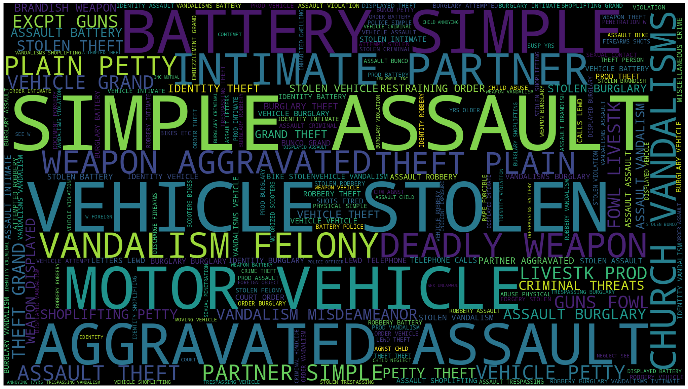
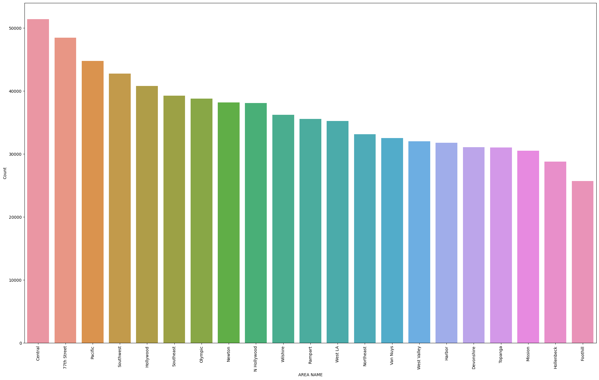
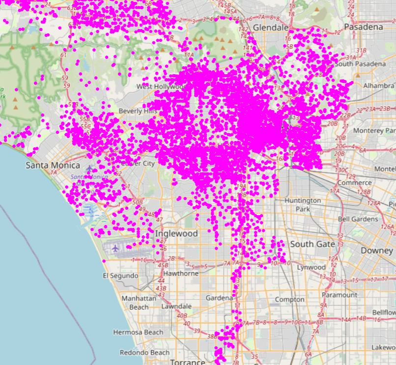
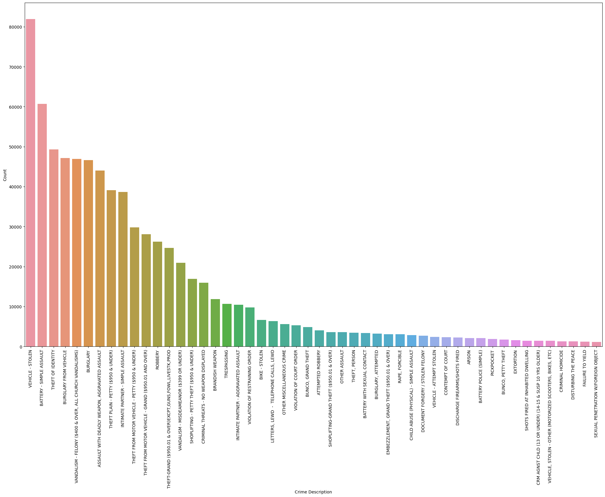

# Crimes-Data-Analysis-and-Visualization-EDA-

    

## Motivation
Los Angeles has one of the highest crime rates in America. This repository is to explore the crime area and the type of crime located in Los Angeles. The data is collected from [Crime Data From 2020 to Present](https://catalog.data.gov/dataset/crime-data-from-2020-to-present)

## Exploring the Area
The top 50 areas of the crime area are shown below. Central LA has the highest crime rate, with a count above 50,000 total crimes committed since 2020.

    

Here is a screenshot of an interactive location map based on the longitude and latitude. The interactive version is in the ipynb.

    

## Exploring the Crime
The top 50 types of crime committed. The most committed crime is stolen vehicle.

    

